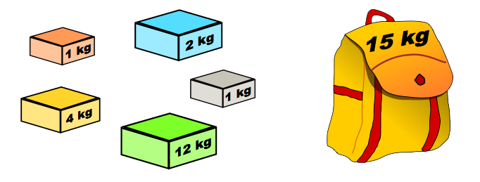

```{r setup, include=FALSE}
options(htmltools.dir.version = FALSE)

# Para utilizar python
library(reticulate)
use_condaenv("r-reticulate", required = TRUE)

```

# Apresentando o Problema

A proposta do problema da mochila é preencher uma mochila com objeto de diferentes valores e pesos de tal forma que a soma dos valores dos objetos escolhidos seja a maior possivel, sem ultrapassar o peso minimo da mochila.



---

#  O Problema da Mochila como um Algoritmo Genético

- **O que é o individuo?** É uma solução candidata para o problema, ou seja, uma combinação de objetos que podem ser colocados na mochila.

- **O que é o gene do individuo?** São os itens escolhidos pelo mochileiro, sendo que cada item possui seu valor e peso.

- **O que é a população?** É o conjunto de N mochilas (indivíduos) geradas aleatóriamente. Sendo assim,  temos N possiveis combinações.

- **Função objetivo:** Maximizar o valor total dos itens da mochila.

- **Função aptidão:** Verifica se o indivíduo está próximo do objetivo, ou seja, se o valor total dos objetos é alto e simultânemente respeita a capacidade.

- **Função crossover:** Gera o filho, ou seja, seleciona configurações de itens para a mochila

- **Função mutação:** Adicionar ou remover algum item aleatório na mochila.

---

# Bibliotecas utilizadas

```{python, engine='python'}

import numpy as np
import pandas as pd
import random
from functools import partial

```

# Função objetivo

```{python, engine='python'}
def f_objetivo(df):
    valor_total = df['Valor'].sum()
    peso_total = df['Peso'].sum()
    return valor_total, peso_total
```

---

# Geração de gene do indivíduo aleatório

```{python, engine='python'}
def f_aleatorio(df):
    n_aleatorio = np.random.randint(1, df.shape[0]+1)
    df_aleatorio = df.sample(n = n_aleatorio)
    return df_aleatorio
```

---

# Função aptidão

```{python, engine='python'}
def f_aptidao(df_gene, capacidade): 
    valor = f_objetivo(df_gene)[0]
    peso = f_objetivo(df_gene)[1]

    if peso <= capacidade:
        podenracao = 1
    else:
        podenracao = 0

    aptidao = podenracao*(valor + peso)
    return aptidao
```

---

# Crossover

```{python, engine='python'}
def f_crossover(df_pai_1, df_pai_2):
    df_gene_pai_1_aleatorio = f_aleatorio(df_pai_1)
    df_gene_pai_2_aleatorio = f_aleatorio(df_pai_2)
    df_concat = pd.concat([df_gene_pai_1_aleatorio,
    df_gene_pai_2_aleatorio])
    df_gene_filho = df_concat.drop_duplicates()
    return df_gene_filho
```

# Função para realizar a mutação

```{python, engine='python'}
def f_mutacao(df_gene, df_mochileiro):
    linha = np.random.randint(0, df_gene.shape[0])
    mutacao = df_mochileiro.sample(n = 1)
    df_gene.iloc[linha] = mutacao
    df_gene = df_gene.drop_duplicates()
    return df_gene
```
---

# Algoritmo genético

```{python, engine = 'python'}

def algoritmo_genetico(df_mochileiro, capacidade):
    populacao = [f_aleatorio(df_mochileiro) for _ in range(50)] 
    
    for _ in range(100):  
        aptidao_populacao = [f_aptidao(df_gene = x, capacidade = capacidade) for x in populacao]

        parentes = random.choices(populacao, weights = aptidao_populacao, k = 100) 
                                  
        nova_geracao = [f_mutacao(df_gene = f_crossover(random.choice(parentes),
                                                        random.choice(parentes)),
                                            df_mochileiro = df_mochileiro)
                                            for _ in range(50)]

        populacao = nova_geracao

    f_aptidao_fixando_capacidade = partial(f_aptidao, capacidade = capacidade) 
    resultado = max(populacao, key = f_aptidao_fixando_capacidade)
    
    return resultado
```

---

# Aplicação

```{python, engine = 'python'}
dado = {'Item': [1, 2, 3, 4, 5],
        'Valor': [4, 2, 1, 2, 10],
        'Peso': [12, 2, 1, 1, 4]}

df = pd.DataFrame(dado)

capacidade_max = 15

resultado = algoritmo_genetico(df_mochileiro = df,
capacidade = capacidade_max)
print(resultado)

```


